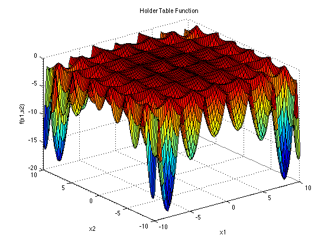

# B06-Holder-Table-Function
La función Tabla de soporte tiene muchos mínimos locales, con cuatro mínimos globales.

## Entrada
$$(x_1, x_2)$$
La función suele evaluarse sobre el cuadrado xi ∈ [-10, 10], para todo i = 1, 2. Esta función fue diseñada específicamente para presentar múltiples mínimos locales y regiones con superficies planas, lo que hace que sea un problema de optimización desafiante.


## Función objetivo
```math
f(x) = -|sin(x_1) cos(x_2) exp(|1-\frac{\sqrt {x_1^2+x_2^2}}{ π}|)|
```
## Mínimo global
La función de Holder Table es conocida por tener varios mínimos locales y un único mínimo global. El valor del mínimo global es -19.2085 y se alcanza en los siguientes puntos:
| $$x_1$$ | $$x_2$$ | Column 3 |
|---------|---------|----------|
| 8.05502 | 9.66459 | -19.2085 |
| 8.05502 | -9.66459| -19.2085 |
| -8.05502| 9.66459 | -19.2085 |
| -8.05502| -9.66459| -19.2085 |

## Aplicaciones
La función de Holder Table es una función matemática que se utiliza a menudo como un problema de optimización en la evaluación de algoritmos de optimización y técnicas de búsqueda global. Se utiliza como un problema de prueba para evaluar la eficacia de los algoritmos en la resolución de problemas de optimización no lineales.

Además de su uso como problema de prueba en la optimización, la función de Holder Table también se ha utilizado en aplicaciones en las que es necesario minimizar una función no lineal. Ejemplos de tales aplicaciones incluyen en la optimización de diseños de sistemas, en el análisis de procesos químicos y en la optimización de procesos industriales.

La función de Holder Table también se ha utilizado en la generación de paisajes fractales y en la creación de modelos de terrenos. En este contexto, la función se utiliza para generar paisajes con características fractales y para simular la formación de terrenos naturales.

## Acerca de
En 1987, el matemático J. Moser propuso una función matemática llamada "función de mesa de soporte" como un problema de optimización. En ese momento, Moser estaba trabajando en problemas de dinámica no lineal y necesitaba un problema de optimización que pudiera evaluar la estabilidad numérica de los algoritmos de seguimiento de órbitas que son utilizados en la dinámica no lineal para estudiar el comportamiento de los sistemas dinámicos. 
